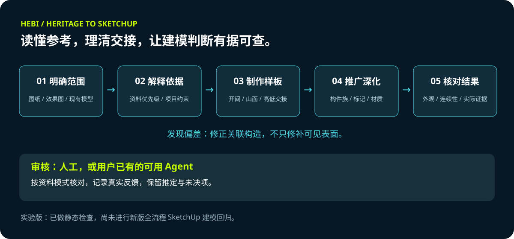
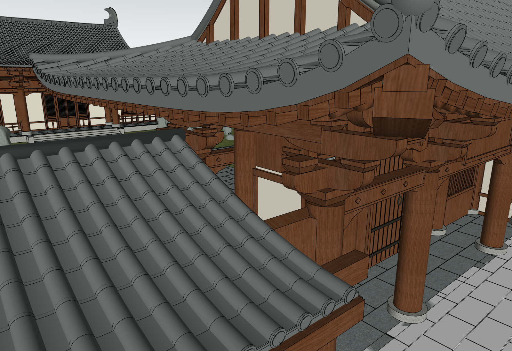
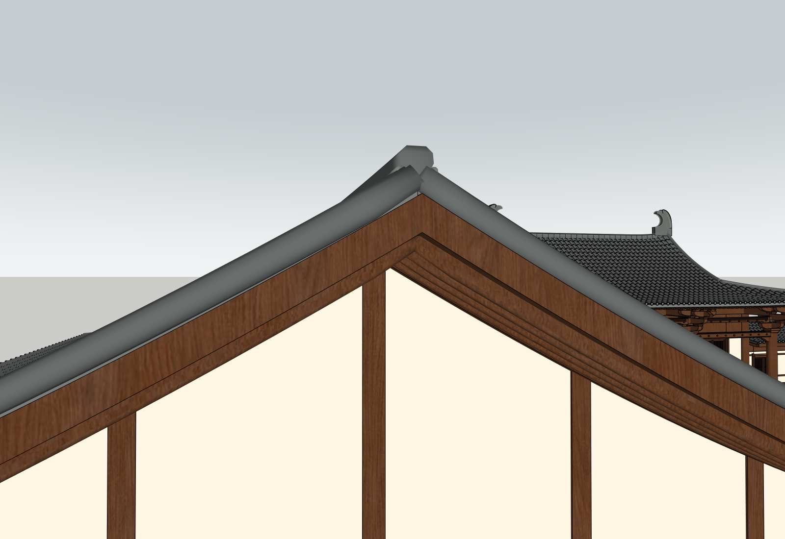
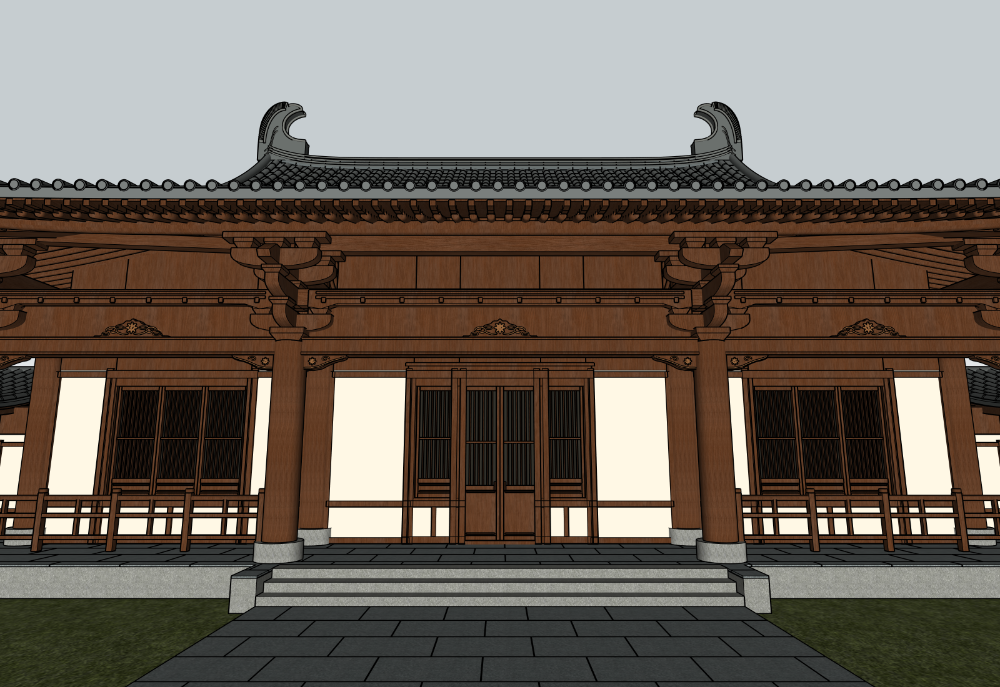
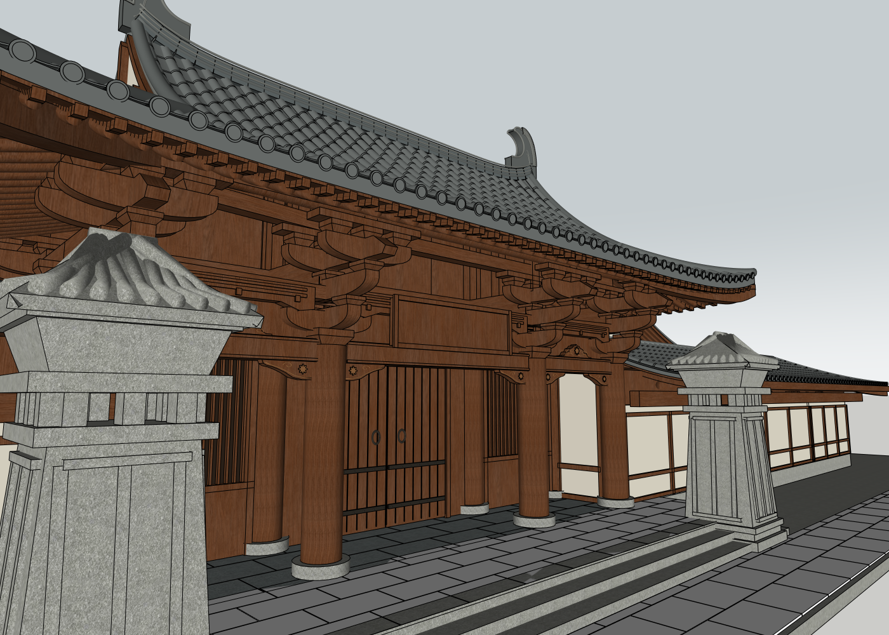
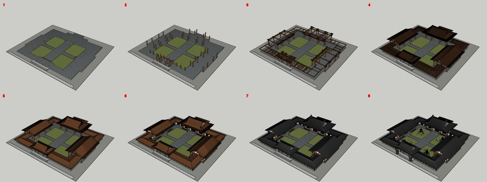

**简体中文** · [English](README.en.md)

  

<h1 align="center">HEBI · 古建与仿古建筑 SketchUp 建模</h1>

<strong>读懂参考，理清交接，让每一次建模判断都有依据。</strong>

中国传统建筑 · Windows · SketchUp · 人工或可用 Agent 审核

> **2026.09.23 · 实验版工作流**
> 已完成 skill 格式及静态检查。新版尚未做完整 SU 建模回归，也未验证两版插件并存运行。

## 这是什么？

这是一个独立的古建与仿古建筑建模 Skill，支持 CAD、参考效果图以及已有 SketchUp 模型的深化。
它从 [HEBI CAD to SketchUp 911](https://github.com/www41818520-coder/hebi-cad-to-sketchup-911-draft) 独立分支，现代建筑原版保持不变。

本包保留 911 工具，并补充木构架关系、屋顶与檐口交接、山墙、瓦作和效果图推演的方法。它需要能够读取项目文件、看图和执行脚本的主 Agent 配合使用，**不是独立建模软件，也不是现成的参数化古建构件库**。

资料条件决定流程，建筑类型决定检查内容。设计推演与历史复原应分清；AI 效果图不能单独证明历史真实性。

## 如何工作

1. **明确范围**：识别资料条件、当前模型、已确认约束和用户修改。
2. **解释依据**：分别确定平面、标高、屋顶、门窗、材料和缺失信息的来源。
3. **制作样板**：先完成典型开间、山面或高低屋顶交接，再重复构件。
4. **推广深化**：检查关联关系后推广同类构件，创建时即分配标记。
5. **核对结果**：结合实际 SKP 证据，检查外观与建构连续性，记录真实审核意见。

发现问题时，修正最早出错的解释或连接关系，而不是不断叠加补丁。

## 三种资料模式

| 模式 | 建模依据 | 审核边界 |
| --- | --- | --- |
| 完整图纸 | 对位后的平面、立面、剖面和详图 | 沿用完整图纸合同及独立 QA 工具 |
| 平面＋效果图 | 平面几何、用户明确决定、已标注的视觉推定 | 核对平面约束、参考特征和构件交接，不伪造缺失图纸的通过记录 |
| 既有模型修订 | 当前 SKP、用户编辑及本次修改要求 | 检查变动构件、关联交接和受影响场景 |

参考模型用于合理补缺，不自动覆盖主要效果图。项目特有的直脊、不起翘、夹板厚度等，不推广为所有古建的默认规则。

## 古建分支补充了什么

| 关注内容 | 处理原则 |
| --- | --- |
| 木构架 | 联合检查柱截面连续、梁的支承及斗拱承托对象 |
| 高低屋顶 | 协调屋面、瓦排、望板、椽檩和封板，同时保留通行空间 |
| 山面与檐口 | 核对连续轮廓、墙顶封闭和真实交接 |
| 瓦作 | 排瓦沿坡，瓦当与滴水对齐实际瓦垄端点 |
| 装饰 | 先比例和依托，后纹样；区分年代证据与设计解释 |
| 增量修改 | 保留用户编辑，更新相关构件族，避免无必要的全模型重建 |
| 标记与场景 | 原始边面保持未标记，群组或组件分类，保护显隐与播放时间 |

## 实际建模过程

**以下是形成这个 Skill 的宅院项目实际过程图。** 它们来自多轮建模、用户看图修正与项目专用脚本，不是新版 Skill 打包后的全流程自动测试结果，也不代表历史真实性认证或最终建筑验收。版本号用于区分当时的模型状态。

### 01 / V16 — 处理低廊与山门的交接

屋面收头、瓦排、望板和木构需要共同协调。检查它们与主柱、斗拱的关系，不能只修剪一块可见表面。

### 02 / V16 — 让山面收口连续

关注斜向板件、竖向木骨及山尖的连接。整体轮廓看起来完整，仍需要近景检查具体交接。

### 03 / V18 — 区分枋间封板与雕饰层次

本项目采用木板位于雕饰背后的设计解释，保留梁枋与饰件的前后层次；不把这一做法称为普遍的唐代标准构造。

### 04 / V20 — 将已核对的做法推广到相关建筑

同类夹板按各处实际开间和高度补齐，保留建筑主次差异。新增构件沿用围护标记及既有动画出现阶段。

### 05 / V19 — 为阶段展示整理标记与场景

图中 1—8 依次为地面台基、木柱、梁枋斗拱、檩椽角梁、望板封檐、围护门窗、瓦面脊饰、景观。它是累计显隐场景，不是构件运动动画，也不是经核准的施工顺序。此图记录 V19，早于 V20 的夹板补充。

## 标记与生长动画

分类按项目需要调整。新构件应继承正确标记和出现阶段，修改后核对场景显隐、镜头、播放勾选、过渡与停留时间。

镜头过渡、标记逐层显示、构件飞入或升起、视频叠化是不同的交付形式。只调整场景过渡时间，不会自动得到构件升起动画。

## 安装与开始

**环境要求：** Windows、可读取文件和执行脚本的主 Agent、skill 中列出的 Python 依赖，以及具备当前流程所需操作能力的 SketchUp。继承的白模墙体合并流程需要 SketchUp Pro 实体运算；DWG 需要授权可用的转换工具或用户提供 DXF。

下载 [完整 Skill ZIP](dist/heritage-to-sketchup-model.zip)，或使用 [完整 Skill 文件夹](skills/heritage-to-sketchup-model/)。
将整个 `heritage-to-sketchup-model` 文件夹放进 Agent 的 skills 目录；Codex 默认为 `~/.codex/skills/`。现代建筑继续保留原 911 文件夹。

例如：

> 使用 $heritage-to-sketchup-model，根据本目录平面和效果图深化宅院。保留已确认的位置，先检查屋顶与木构交接，再补装饰。

[Skill 入口](skills/heritage-to-sketchup-model/SKILL.md) 会按任务读取对应专题。执行指引目前以中文为主，仓库介绍提供中英文。

沿用项目选择的人工或可用 Agent 审核方式；人工审核不需要额外订阅其他 Agent，也不要求用户填写 JSON。
古建桥接插件、配置和 Ruby 模块采用独立名称。安装 Skill 不会自动安装 SU 插件；两版插件共存尚未实测，安装前需核对现状及授权。

## 验证范围与限制

- 已检查 skill 格式、Python 与 PowerShell 语法、UI 配置及新增文档链接。
- 准备时核对现代版 911 的 107 个源文件哈希未变。
- 包含继承的 911 自动化测试，但本古建版**尚未重新运行该测试集**。
- 未做新版完整 SU 建模回归、双插件运行测试，也没有测得参考图相似度百分比。
- 名称隔离降低覆盖风险，不等于已证明运行兼容。
- 保存成功或实体闭合，不等于建构关系合理；不提供历史真实性、结构安全或施工加工认证。

详见 [发布说明](RELEASE_NOTES.md)。仓库仅包含获授权的模型过程截图，不包含 CAD、SKP 或原始客户参考图。

保留原 HEBI 品牌风格。许可证：暂未指定。
