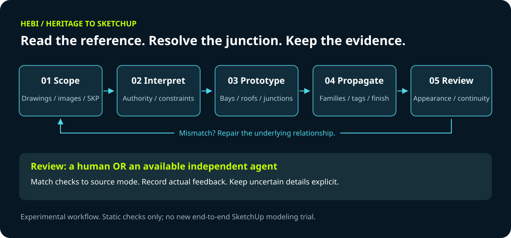

  

<h1 align="center">HEBI · Heritage to SketchUp</h1>

<strong>Read the reference. Resolve the junction. Keep every decision traceable.</strong>

Chinese traditional architecture · Windows · SketchUp · Human or optional agent review

> **Release 2026.09.23 · Experimental workflow**
> Skill structure and static checks passed. No new end-to-end SketchUp modeling trial or dual-plugin runtime test has been performed for this release.

## What is this?

A standalone Skill branch for modeling Chinese traditional and heritage-style architecture from CAD, reference images, or an existing SketchUp model.
It builds on [HEBI CAD to SketchUp 911](https://github.com/www41818520-coder/hebi-cad-to-sketchup-911-draft) while keeping the original modern-building Skill unchanged.

The package combines the copied 911 tools with focused guidance for timber-frame relationships, roof and eave junctions, gables, tilework, and reference-driven detailing.
It is not a ready-made parametric heritage component library, standalone modeling software, or an authenticated historical reconstruction system.

**One heritage Skill, three source modes.** Source completeness determines the workflow; the architectural style determines which component checks apply.

## How it works

1. **Scope** the source material, the active model, confirmed constraints, and existing user edits.
2. **Interpret** authority separately for positions, levels, roof form, openings, materials, and missing information.
3. **Prototype** a representative bay, gable, or high-to-low roof junction before repeating its components.
4. **Propagate** only after checking the relevant relationships; classify components into tags as they are created.
5. **Review** appearance and architectural continuity using actual model evidence and the selected review route.

When a mismatch appears, repair the underlying relationship and its affected components, rather than layering patches over the visible symptom.

## Choose the source mode

| Mode | What controls the model | Review boundary |
| --- | --- | --- |
| Complete drawings | Registered plans, elevations, sections and details | Retain the inherited drawing contracts and independent QA tools |
| Plan + reference images | Plan geometry, explicit user decisions, and labeled visual interpretations | Check plan constraints, reference features, and model junctions; do not invent missing drawing PASS results |
| Existing-model revision | The current SKP, user edits and the requested change | Check the changed components, related junctions, and affected scenes |

AI reference images can guide design intent, but they do not establish historical authenticity.
A reference model fills missing information only where appropriate; it does not automatically override the primary design reference.

## What the heritage branch adds

| Focus | Working rule |
| --- | --- |
| Timber frame | Check column continuity, beam support and bracket relationships together |
| High and low roofs | Coordinate roof edges, tiles, boards, rafters and end closures while preserving required passage space |
| Gables and eaves | Check continuous profiles, wall-top closure and actual intersections |
| Tilework | Align tile direction and eave-end pieces with the roof slope and tile rows |
| Ornament | Establish proportions and attachment first; distinguish period evidence from design interpretation |
| Incremental changes | Preserve user edits and update the affected component family, not the whole model unnecessarily |
| Tags and scenes | Keep raw geometry Untagged, classify containers, and preserve scene visibility and timing |

Project-specific choices—such as a straight wing roof ridge, a particular board thickness or a plain corridor—are not universal heritage rules.

## Tags and growth presentations

A useful starting order is ground and bases → columns → beams and brackets → purlins and rafters → roof boards → enclosure and joinery → roof tiles and ridge ornaments → landscape.
Adapt that grouping to the project. New components inherit the appropriate tag and appearance stage.

Camera transitions, cumulative tag visibility, moving components, and video crossfades are different deliverables.
Changing scene transition time alone does not create a component-rise animation.

## Install and start

**Requirements:** Windows, a primary agent able to inspect project files and run scripts, the dependencies in the Skill, and SketchUp with the operations required by the selected workflow.
The inherited white-wall union path requires SketchUp Pro solid operations. DWG needs an available authorized conversion path or a supplied DXF.

Download the [heritage Skill package](dist/heritage-to-sketchup-model.zip), or use the [complete Skill folder](skills/heritage-to-sketchup-model/).
Copy the whole `heritage-to-sketchup-model` folder to your agent's skills directory. For Codex, the default is `~/.codex/skills/`.
Keep the original 911 folder if you also work on modern buildings.

Then ask:

> Use $heritage-to-sketchup-model to refine this courtyard from the plan and reference images. Preserve confirmed positions and inspect roof-to-frame junctions before adding ornament.

The [Skill entrypoint](skills/heritage-to-sketchup-model/SKILL.md) routes to focused references as needed. Most implementation guidance is in Chinese.
Reuse the project's chosen human or available-agent review route. A human reviewer does not need an additional agent subscription or to fill out JSON files.

The heritage bridge uses distinct plugin, configuration and Ruby module names. Package installation does not install the SketchUp plugin automatically.
Coexistence of both plugins has not been runtime-tested; check the current installation before authorizing setup.

## Validation and limitations

- Skill frontmatter and entrypoint validation passed.
- Python syntax, PowerShell syntax, UI metadata and new documentation links were checked.
- The original 911's 107 source files were checked for unchanged hashes during preparation.
- The copied 911 automated test suite is included, but was **not rerun** as part of this heritage release.
- There was **no new SketchUp modeling trial**, dual-plugin execution test, or measured reference-similarity score.
- Naming isolation reduces overwrite risk; it is not proof of runtime compatibility.
- Successful saves and closed solids do not prove architectural or structural correctness.
- This release does not certify historical authenticity, structural safety, construction or fabrication details.

See [release notes](RELEASE_NOTES.md) for the scope of this release. Project CAD, SKP files and client reference images are not included.

Original HEBI branding is retained. License: not yet specified.
